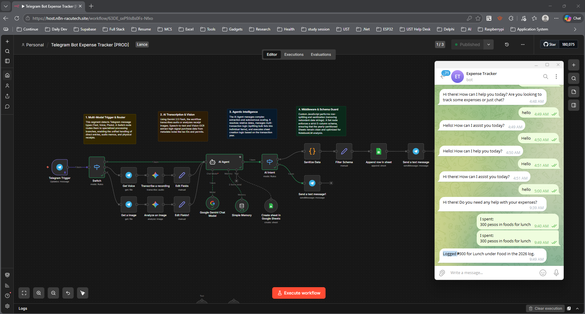

# AI Expense Tracker Assistant

A multimodal AI-powered expense tracking assistant built in n8n. Send a text message, voice note, or photo of a receipt to a Telegram bot — the AI extracts the transaction details and logs them automatically to a yearly-partitioned Google Sheet.

No app switching, no manual entry. Just message your bot and your expenses are tracked.



---

## How It Works

```
Telegram Message
      ↓
Input Type Switch
      ├── Text    → AI Agent (direct)
      ├── Voice   → Download → Gemini Transcription → AI Agent
      └── Photo   → Download → Gemini Vision OCR → AI Agent
                                    ↓
                              AI Agent (Gemini + Memory)
                                    ↓
                           Output Router
                           ├── Financial JSON → Sanitize → Filter Schema
                           │                       ↓
                           │               Append to Google Sheet
                           │                       ↓
                           │               Telegram Confirmation
                           └── Conversational → Telegram Reply
```

---

## Pipeline Breakdown

**Telegram Trigger**
Listens for any incoming message on the connected Telegram bot — text, voice, or photo.

**Input Type Switch**
Routes the message into one of three processing branches based on what was sent:
- `message.text` exists → text branch
- `message.voice.file_id` exists → voice branch
- `message.photo` exists → photo branch

**Voice Branch — Transcription**
Downloads the voice note file from Telegram, then sends it to Gemini 2.5 Flash for speech-to-text transcription. Filters out metadata noise like tax IDs and permit numbers, keeping only high-signal purchase data.

**Photo Branch — Vision OCR**
Downloads the receipt image from Telegram, then sends it to Gemini's vision model for OCR analysis. Extracts item names, amounts, dates, and merchants directly from the receipt image.

**AI Agent (Gemini + Simple Memory)**
The core of the workflow. Receives the normalized input (text, transcript, or OCR output) and performs intelligent extraction:
- Resolves relative dates (e.g. "yesterday", "last Friday") to actual dates
- Splits bulk transaction lists into individual line items
- Determines the correct Google Sheet tab based on the transaction year
- Creates a new yearly sheet tab if one doesn't exist yet
- Returns either structured JSON (for financial entries) or a conversational reply (for questions or unclear input)

**Output Router**
Detects whether the AI Agent's output is structured JSON (starts with `{` or `[`) or a conversational response, and routes accordingly:
- **Financial JSON** → proceeds to data sanitization and logging
- **Conversational** → sends a chat reply directly back to Telegram

**Sanitize Data**
A JavaScript Code node performs row-splitting for multi-transaction outputs and strips redundant date strings from the extracted data.

**Filter Schema**
A Set node enforces a strict 5-column schema before writing to Google Sheets, ensuring the data stays clean and consistent:
```
Date | Description | Amount | Category | Payment Method
```

**Append to Google Sheet**
Appends the sanitized, schema-validated row to the correct yearly tab in the connected Google Sheet.

**Telegram Confirmation**
Sends a confirmation message back to the user in Telegram confirming the expense was logged.

---

## Stack

| Component | Tool |
|---|---|
| Automation platform | n8n Cloud |
| Interface | Telegram Bot |
| AI model | Google Gemini 2.5 Flash |
| Transcription | Gemini Audio (speech-to-text) |
| Receipt OCR | Gemini Vision |
| Memory | n8n Simple Memory (buffer window) |
| Storage | Google Sheets (yearly partitioned) |

---

## Setup

### Prerequisites
- n8n Cloud account (or self-hosted n8n)
- Telegram account + a bot created via [@BotFather](https://t.me/BotFather)
- Google Gemini API key
- Google account with Sheets access

### 1. Create a Telegram Bot

1. Open Telegram and message [@BotFather](https://t.me/BotFather)
2. Send `/newbot` and follow the prompts
3. Copy the **Bot Token**

### 2. Create the Google Sheet

Create a Google Sheet named `Expense Tracker` with at least one tab named after the current year (e.g. `2026`). Add these headers in row 1:

```
Date | Description | Amount | Category | Payment Method
```

The AI Agent will automatically create new yearly tabs as needed.

Copy the **Sheet ID** from the URL:
`https://docs.google.com/spreadsheets/d/`**`YOUR_SHEET_ID`**`/edit`

### 3. Import the Workflow

1. In n8n → **Workflows** → **Import**
2. Upload `AI_Expense_Tracker_Assistant.json`
3. Assign all credentials
4. Update the Google Sheet ID in the Append and Create sheet nodes
5. Activate the workflow
6. Copy the n8n webhook URL and register it as your Telegram bot's webhook

### 4. Credentials

| Credential | Type | Used For |
|---|---|---|
| Telegram API | Bot Token | Trigger + sending replies |
| Google Gemini (PaLM) | API Key | Transcription, OCR, AI Agent |
| Google Sheets OAuth2 | OAuth2 | Logging expenses |

---

## Usage Examples

**Text message:**
```
Bought coffee at Starbucks for ₱6.50 this morning
```

**Voice note:**
> "Paid ₱120 for groceries at Whole Foods yesterday with my credit card"

**Photo:**
> *[sends a photo of a restaurant receipt]*

All three result in a structured row being added to the Google Sheet and a confirmation sent back in Telegram.

---

## Google Sheet Output

Each logged expense produces a row like:

| Date | Description | Amount | Category | Payment Method |
|---|---|---|---|---|
| 2026-04-10 | Starbucks coffee | ₱6.50 | Food & Drink | Cash |
| 2026-04-09 | Whole Foods groceries | ₱120.00 | Groceries | Credit Card |

---

## Known Limitations

- **Gemini demand spikes** — Gemini 2.5 Flash can return 503 errors during peak usage. Auto-retry is recommended on both Gemini nodes
- **Ambiguous input** — if a message is unclear or lacks enough detail (missing amount, missing date), the AI Agent will respond conversationally asking for clarification rather than logging
- **Image quality** — low-resolution or crumpled receipt photos may produce incomplete OCR results
- **Single currency** — the workflow does not perform currency conversion; amounts are logged as-is from the input

---

## Production Improvements

- **Monthly budget alerts** — add a scheduled node that checks total spend per category and sends a Telegram alert when approaching a budget limit
- **Recurring expense detection** — flag transactions that match known recurring patterns (subscriptions, rent) and auto-categorize them
- **Multi-user support** — map Telegram user IDs to individual Google Sheets for shared household or team expense tracking
- **Export to PDF** — add a monthly summary generation node that compiles a formatted expense report and sends it via Telegram or email
- **Voice confirmation** — read back the logged entry via Telegram voice message for eyes-free verification

---

## License

MIT
