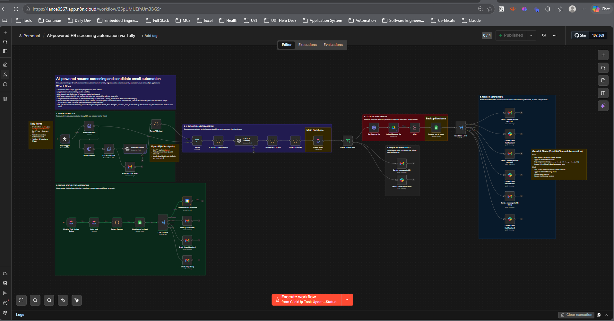

# AI-Powered HR Screening Automation

An end-to-end AI-driven recruitment pipeline built in n8n that automatically screens job applications, scores candidates, routes them into tiers, sends personalized emails, and keeps HR updated in real time — all without manual review.

Candidate submits a Tally form → AI screens their CV → they receive a personalized response → HR gets a full candidate brief and a ClickUp task to manage the process.



---

## How It Works

```
Tally Form Submission
        ↓
Normalize Input Fields
        ↓
Download & Extract CV (PDF → Text)
        ↓
AI Resume Parser (GPT-4.1 Mini)
        ↓
Fetch Job Description + AI ATS Screener
        ↓
Package ATS Data
        ↓
    ┌─────────────────────┐
    │                     │
Passed                Not Passed
    │                     │
Upload CV to Drive    (End)
    │
Append to ATS Sheet
    │
Create ClickUp Task
    │
Candidate Level Switch
    ├── Strong   → HR Priority Email + Slack Alert
    ├── Moderate → HR Normal Email + Slack Alert
    └── Weak     → HR Low Email + Slack Alert

─── ClickUp Status Update Trigger ───
        ↓
Get Task + Extract Payload
        ↓
Update ATS Sheet Row
        ↓
Check Status Switch
    ├── Interview     → Google Calendar Invite
    ├── Shortlisted   → Candidate Email
    ├── Consideration → Candidate Email
    └── Rejected      → Rejection Email
```

---

## Pipeline Breakdown

**Tally Trigger**
Fires when a candidate submits the job application form. Captures name, email, phone, CV upload, preferred interview date, and possible start date.

**Normalize Input**
Standardizes the raw Tally payload into consistently named fields used throughout the rest of the workflow.

**Download & Extract CV**
Downloads the uploaded PDF resume and extracts raw text using n8n's Extract from File node — making it readable for the AI.

**AI Resume Parser (GPT-4.1 Mini)**
Sends the raw CV text to GPT-4.1 Mini with a strict structured prompt. Returns a detailed JSON object with tech stack, programming languages, frameworks, years of experience, role history with key achievements, strengths, concerns, and recommended interview focus areas.

**Fetch Job Description + AI ATS Screener**
Loads the relevant job description from Google Sheets and passes it alongside the parsed CV to a second AI node. Returns a qualification result (Passed / Failed), a numerical score, a tier (Strong / Moderate / Weak), and an overall assessment.

**Package ATS Data**
Combines all AI outputs, form data, and evaluation results into a single structured payload used by all downstream nodes.

**CV Upload to Google Drive**
For qualified candidates, uploads their resume to a designated Google Drive folder named after the candidate.

**Append to ATS Tracking Sheet**
Logs the full candidate record — name, email, score, tier, experience, qualification, resume link, ClickUp task ID — to a Google Sheets ATS tracker.

**Create ClickUp Task**
Creates a candidate task in ClickUp with the full AI brief — profile details, strengths, concerns, and interview focus areas — so HR has everything in one place.

**Candidate Level Routing**
A Switch node routes into three branches based on AI tier:
- **Strong** → priority HR email + Slack alert
- **Moderate** → normal HR email + Slack alert
- **Weak** → low-priority HR email + Slack alert

**ClickUp Status Update Trigger**
A separate trigger listens for ClickUp task status changes made by HR. When HR moves a candidate forward or rejects them, the automation fires automatically.

**Candidate Email Routing**
Based on the ClickUp status the candidate receives a personalized email:
- **Interview** → confirmation + Google Calendar invite
- **Shortlisted** → hold notification
- **Consideration** → acknowledgment email
- **Rejected** → rejection email with positive feedback

---

## Stack

| Component | Tool |
|---|---|
| Automation platform | n8n Cloud |
| Application form | Tally |
| AI model | GPT-4.1 Mini (OpenAI) |
| Task management | ClickUp |
| ATS tracking | Google Sheets |
| CV storage | Google Drive |
| Calendar | Google Calendar |
| Notifications | Gmail + Slack |

---

## Setup

### Prerequisites
- n8n Cloud account (or self-hosted n8n)
- Tally account with a job application form
- OpenAI API key
- ClickUp workspace
- Google account (Sheets, Drive, Gmail, Calendar)
- Slack workspace

### 1. Tally Form

Create a form with at minimum these fields:
- Full name
- Email address
- Phone number
- CV / Resume upload (PDF)
- Preferred interview date
- Possible start date

Copy the **Form ID** from the Tally URL.

### 2. Google Sheets

**Job Descriptions sheet** — one row per open role:
```
Job Title | Job Description | Upload Folder ID | Sheet Tab ID
```

**Applicants Tracking sheet** — one tab per role:
```
Full Name | First Name | Last Name | Email | Phone Number |
Date Applied | Qualification | Score | Candidate Level |
Experience | Resume Link | Overview | Status |
Possible Start Date | Preferred Interview Date | ClickUp ID
```

### 3. Google Drive

Create a folder per job role for CV storage. Copy each folder ID into the Job Descriptions sheet.

### 4. ClickUp

Create a List with these statuses:
```
New → Interview → Shortlisted → Consideration → Rejected
```

### 5. Import the Workflow

1. In n8n → **Workflows** → **Import**
2. Upload `AI-powered_HR_screening_automation_via_Tally.json`
3. Assign all credentials
4. Update the Tally Form ID in the trigger node
5. Update Google Sheet IDs and ClickUp List ID
6. Activate both workflows

### 6. Credentials

| Credential | Type | Used For |
|---|---|---|
| Tally API | API Key | Form trigger |
| OpenAI API | API Key | Resume parsing + ATS scoring |
| Google Sheets OAuth2 | OAuth2 | Job descriptions + ATS tracker |
| Google Drive OAuth2 | OAuth2 | CV uploads |
| Gmail OAuth2 | OAuth2 | Candidate + HR emails |
| Google Calendar OAuth2 | OAuth2 | Interview invites |
| ClickUp API | API Key | Task creation + status trigger |
| Slack OAuth2 | OAuth2 | HR Slack notifications |

---

## AI Scoring Output

Every candidate evaluation returns:

| Field | Description |
|---|---|
| `qualification` | `Passed` or `Failed` |
| `score` | Numeric fit score |
| `tier` | `Strong`, `Moderate`, or `Weak` |
| `strengths` | Top 3 candidate strengths |
| `concerns` | Top 3 gaps or missing skills |
| `interview_focus_areas` | Recommended interview question topics |
| `overall_assessment` | 2–3 sentence executive summary |
| `recommendation` | One-line suggested next step |

---

## Known Limitations

- **PDF only** — CV extraction is optimized for PDF. Word docs or image-based scans may produce incomplete text
- **Single role per run** — each submission is matched to one job description; multi-role applications are not supported
- **OpenAI dependency** — rate limits or outages will stall the pipeline; auto-retry is recommended on both AI nodes
- **ClickUp status names are hardcoded** — status values in the Switch node must exactly match your ClickUp list configuration

---

## Production Improvements

- **Multi-role support** — detect the applied role and dynamically load the matching job description
- **Duplicate detection** — check for existing email entries in the ATS sheet before processing
- **Self-scheduling** — integrate Calendly or Cal.com so candidates can pick their own interview slot
- **Candidate status portal** — send applicants a link to check their application status in real time
- **Feedback loop** — feed post-interview HR notes back into the AI to improve scoring calibration over time

---

## License

MIT
