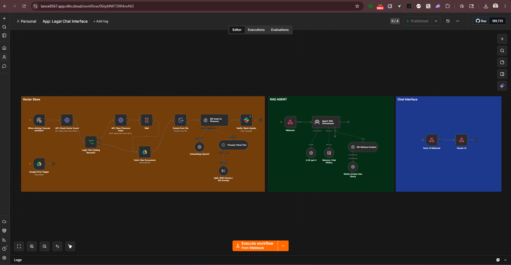

# Legal Chat Interface

A self-contained RAG (Retrieval-Augmented Generation) application built entirely in n8n. Upload legal documents to Google Drive and instantly get a fully functional chat interface where users can ask questions and receive accurate, context-grounded answers — powered by GPT-4 and Pinecone.

No external app framework required. The entire frontend is served directly from n8n via a webhook.



---

## How It Works

Two independent pipelines work together:

### Pipeline 1 — Document Ingestion (Manual)
```
Manual Trigger
      ↓
Check Pinecone Vector Count
      ↓
Has Existing Records?
  ├── Yes → Clear Pinecone Index → Wait → Fetch Documents
  └── No  → Fetch Documents
      ↓
Fetch Raw Documents from Google Drive
      ↓
Extract Text from File
      ↓
Parse + Chunk (1000 tokens / 100 overlap)
      ↓
Embed with OpenAI
      ↓
Insert to Pinecone Vector Store
      ↓
Notify via Slack
```

### Pipeline 2 — Chat Interface (Live)
```
User Opens Browser → Fetch UI Webhook → Render HTML Chat Interface
                                                  ↓
                                         User Sends Question
                                                  ↓
                                      Webhook (Chat API endpoint)
                                                  ↓
                               RAG Orchestrator Agent (GPT-4)
                               ├── Embed User Query (OpenAI)
                               ├── Retrieve Context (Pinecone)
                               └── Chat Memory (Buffer Window)
                                                  ↓
                                         Grounded Response
```

---

## Pipeline Breakdown

### Document Ingestion

**Manual Trigger**
Run this pipeline whenever legal documents are added or updated in Google Drive. Designed to be re-run on demand to refresh the knowledge base.

**Check Vector Count + Logic Gate**
Before ingesting, the workflow checks whether Pinecone already contains vectors. If records exist, the index is cleared first to prevent stale or duplicate data. If the index is empty, ingestion proceeds directly.

**Fetch Raw Documents from Google Drive**
Retrieves all documents from the designated Google Drive folder. Supports any file format extractable by n8n's Extract from File node.

**Parse + Chunk**
Documents are processed by n8n's Document Default Data Loader and split into 1,000-token chunks with a 100-token overlap using the Recursive Character Text Splitter — preserving semantic continuity across chunk boundaries.

**Embed + Insert to Pinecone**
Each chunk is embedded using OpenAI's embeddings model and inserted into the Pinecone vector store for fast semantic retrieval.

**Slack Notification**
Sends a Slack message confirming the ingestion is complete and the knowledge base is ready.

---

### Chat Interface

**Fetch UI Webhook**
Serves a fully rendered HTML/CSS chat application directly from n8n when a user navigates to the webhook URL in their browser. The interface uses a professional legal aesthetic — navy and gold color scheme with Playfair Display and Inter typography.

**Webhook (Chat API)**
Receives user questions from the frontend as POST requests and passes them to the RAG Orchestrator Agent.

**RAG Orchestrator Agent (GPT-4)**
The core intelligence layer. For every user query it:
- Embeds the question using OpenAI
- Retrieves the most semantically relevant document chunks from Pinecone
- Passes retrieved context + conversation history to GPT-4
- Returns a grounded, context-aware response

**Memory: Chat History**
A buffer window memory node maintains conversational context across multiple turns, enabling follow-up questions without losing prior context.

---

## Stack

| Component | Tool |
|---|---|
| Automation platform | n8n Cloud |
| LLM | GPT-4 (OpenAI) |
| Embeddings | OpenAI Embeddings |
| Vector database | Pinecone |
| Document source | Google Drive |
| Frontend | Custom HTML/CSS (served via n8n webhook) |
| Notifications | Slack |

---

## Setup

### Prerequisites
- n8n Cloud account (or self-hosted n8n)
- OpenAI API key
- Pinecone account with an index created
- Google account with Drive access
- Slack workspace (optional, for ingestion notifications)

### 1. Pinecone Setup

1. Create a free account at [pinecone.io](https://pinecone.io)
2. Create a new index with:
   - **Dimensions:** `1536` (matches OpenAI `text-embedding-ada-002`)
   - **Metric:** `cosine`
3. Copy your **API Key** and **Index Name**

### 2. Google Drive Setup

1. Create a folder in Google Drive for your legal documents
2. Upload your PDFs, Word docs, or text files to this folder
3. Copy the **Folder ID** from the URL:
   `https://drive.google.com/drive/folders/`**`YOUR_FOLDER_ID`**

### 3. Import the Workflow

1. In n8n → **Workflows** → **Import**
2. Upload `App__Legal_Chat_Interface.json`
3. Assign all credentials
4. Update the Google Drive folder ID in the **Fetch: Raw Documents** node
5. Update the Pinecone index name in both Pinecone nodes
6. Activate the workflow

### 4. Ingest Documents

1. Run the **Document Ingestion** pipeline manually using the Execute Workflow trigger
2. Wait for the Slack notification confirming ingestion is complete

### 5. Access the Chat Interface

Open the **Fetch UI Webhook** URL in any browser. The chat interface will load and is ready to use immediately.

### 6. Credentials

| Credential | Type | Used For |
|---|---|---|
| OpenAI API | API Key | GPT-4 chat + embeddings |
| Pinecone API | API Key | Vector storage + retrieval |
| Google Drive OAuth2 | OAuth2 | Document fetching |
| Slack OAuth2 | OAuth2 | Ingestion notifications |

---

## Re-ingesting Documents

When documents are added, removed, or updated in Google Drive:

1. Add or update files in the Google Drive folder
2. Manually run the ingestion pipeline
3. The workflow automatically clears stale vectors and rebuilds the index
4. Wait for the Slack confirmation before using the chat interface

---

## Known Limitations

- **Manual ingestion** — the knowledge base does not update automatically when files change in Google Drive. Re-ingestion must be triggered manually
- **Single folder scope** — the workflow ingests from one Google Drive folder. Nested subfolder traversal is not supported
- **No authentication on the chat UI** — the webhook URL is publicly accessible to anyone who has it. Add IP filtering or a password layer for sensitive deployments
- **Context window limits** — very large documents may exceed chunk relevance thresholds; tune chunk size and overlap based on your document type
- **Pinecone free tier** — limited to one index and a fixed vector count on the free plan

---

## Production Improvements

- **Google Drive Trigger** — automate re-ingestion whenever a file is added or modified in the source folder (the workflow already includes a Google Drive Trigger node for this)
- **Access control** — add token-based authentication to the chat webhook for secure deployments
- **Source citations** — return the document name and page reference alongside each answer so users can verify the source
- **Multi-collection support** — allow users to select which document set to query (e.g. contracts vs. case law vs. compliance docs)
- **Conversation export** — add a button to the chat UI to export the conversation as a PDF transcript

---

## License

MIT
