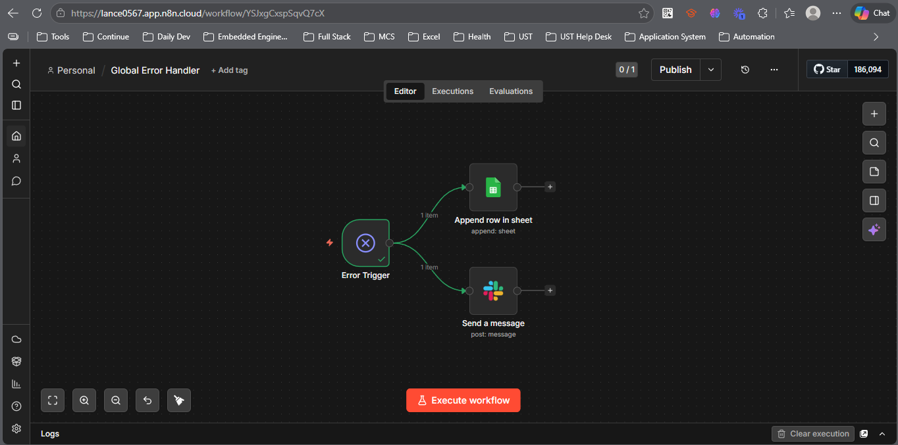

# Global Workflow Error Monitor

A centralized error handling pipeline for n8n that automatically intercepts unhandled exceptions across all active workflows, logs them to Google Sheets, and sends real-time Slack alerts.

Set it once — every workflow on your n8n instance is covered automatically.



---

## How It Works

```
Any Workflow Fails
      ↓
Error Trigger (instance-wide)
      ↓
    ┌─────────────────────────┐
    │                         │
Google Sheets Log         Slack Alert
(persistent audit trail)  (real-time notification)
```

---

## Pipeline Breakdown

**Error Trigger**
n8n's built-in Error Trigger node fires automatically whenever any workflow on the instance encounters an unhandled exception. No configuration needed per workflow — one trigger covers everything.

**Google Sheets — Append Row**
Extracts key telemetry from the error payload and appends a structured row to a persistent audit log. Captures timestamp, workflow name, execution URL, failing node name, and the full error message. Useful for tracking recurring failures, API rate limit patterns, and long-term system health.

| Column | Value |
|---|---|
| Timestamp | Date and time of the failure |
| Workflow | Name of the workflow that failed |
| URL | Direct link to the failed execution in n8n |
| Node | The specific node where the error occurred |
| Error Message | The raw error message |

**Slack — Send Alert**
Formats a human-readable incident report and posts it to a dedicated Slack channel immediately. Includes the workflow name, failing node, timestamp, error message, and a deep link to the execution for rapid triage.

---

## Stack

| Component | Tool |
|---|---|
| Automation platform | n8n Cloud |
| Error capture | n8n Error Trigger (native) |
| Audit logging | Google Sheets API |
| Alerting | Slack API (OAuth2) |

---

## Setup

### Prerequisites
- n8n Cloud account (or self-hosted n8n)
- Google account with Sheets access
- Slack workspace with a dedicated alerts channel

### 1. Create the Google Sheet

Create a new Google Sheet named `Error Logs` with these exact column headers in row 1:

```
Timestamp | Workflow | URL | Node | Error Message
```

Copy the Sheet ID from the URL:
`https://docs.google.com/spreadsheets/d/`**`YOUR_SHEET_ID`**`/edit`

### 2. Import the Workflow

1. In n8n → **Workflows** → **Import**
2. Upload `global_error_monitor.json`
3. Assign your credentials to each node (see below)
4. Update the Google Sheet ID in the **Append row in sheet** node
5. Update the Slack channel ID in the **Send a message** node
6. Activate the workflow

### 3. n8n Credentials

| Credential | Type | Used For |
|---|---|---|
| Google Sheets OAuth2 | OAuth2 | Appending rows to the error log |
| Slack OAuth2 | OAuth2 | Posting alerts to the Slack channel |

### 4. Set as Global Error Workflow

For this workflow to catch errors from all other workflows:

1. Go to n8n **Settings** → **Global Error Workflow**
2. Select this workflow from the dropdown
3. Save

Every workflow on the instance will now route unhandled errors here automatically.

---

## Slack Alert Format

```
Workflow Error: [Workflow Name]
[Node Name] errored at [Timestamp].
The error message was: [Error Message]
See this execution here: [Execution URL]
```

---

## Known Limitations

- **Self-errors are not caught** — if this error monitor workflow itself fails, it won't catch its own exception. Monitor it separately or set up a health check.
- **Credentials required** — if Google Sheets or Slack credentials expire, errors will still be intercepted by the trigger but logging and alerting will silently fail. Rotate credentials regularly.
- **n8n Cloud execution history** — execution URLs are only accessible while the execution history is retained. On free-tier n8n Cloud, older executions may expire.

---

## Production Improvements

- Add a **severity classifier** — distinguish between warnings (e.g. 429 rate limits) and critical failures (e.g. auth errors) and route them to different Slack channels
- Add **error deduplication** — avoid flooding the Slack channel when a workflow fails repeatedly in a short window
- Add a **daily summary** — a scheduled digest of errors grouped by workflow for async review
- Connect to **PagerDuty or OpsGenie** for on-call escalation on critical failures

---

## License

MIT
