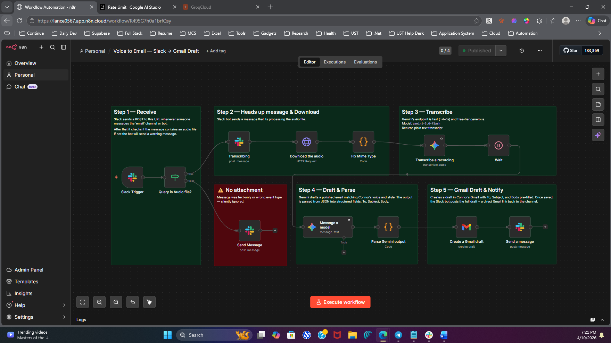

# Voice to Email Automation

An end-to-end n8n automation that turns Slack voice notes into polished, style-matched Gmail drafts — no keyboard required.

Drop a voice note in Slack → get a ready-to-send email draft in Gmail with a direct link back in the channel.



---

## How It Works

```
Slack Voice Note
      ↓
Filter (bot messages & human-only)
      ↓
Download Audio (Slack private URL)
      ↓
Fix Mime Type (video/mp4 → audio/mp4)
      ↓
Transcribe (Gemini 2.0 Flash)
      ↓
Wait (buffer for transcription resolution)
      ↓
AI Agent — Draft Email (Gemini 2.0 Flash + style prompt)
      ↓
Parse JSON Output
      ↓
Create Gmail Draft (OAuth)
      ↓
Slack Notification (draft preview + Gmail deep link)
```

---

## Pipeline Breakdown

**Step 1 — Receive & Filter**
The Slack trigger fires on every message in the designated channel. Two filters run immediately: one drops all bot messages by checking `subtype` to prevent the bot from triggering on its own outbound messages, and one checks for an audio file attachment before proceeding.

**Step 2 — Heads Up & Download**
The bot posts a `Transcribing audio file...` status message so the user knows something is happening. An HTTP Request node then downloads the raw audio binary from Slack's private file URL using the bot token.

**Step 3 — Transcribe**
Slack mislabels audio recordings as `video/mp4`. A Code node corrects the mime type to `audio/mp4` before passing it to Gemini 2.0 Flash for transcription. A 4-second Wait node follows to ensure the result is fully resolved.

**Step 4 — Draft & Parse**
An AI Agent node receives the raw transcript and drafts a polished email using a style-parameterized system prompt. The prompt enforces the executive's specific writing patterns — opener format, em dash usage, CTA phrasing, and a strict two-line sign-off. Output is returned as structured JSON and parsed into `to`, `subject`, and `body` fields.

**Step 5 — Gmail Draft & Notify**
The Gmail node creates a fully pre-filled draft via OAuth. Once saved, the Slack bot posts the complete email preview and a direct Gmail deep link back to the channel for one-tap review and send.

---

## Stack

| Component | Tool |
|---|---|
| Automation platform | n8n Cloud |
| Trigger | Slack API |
| Transcription | Google Gemini 2.0 Flash |
| Email drafting | AI Agent + Gemini 2.0 Flash |
| Output | Gmail API (OAuth) |
| Notification | Slack API |

---

## Setup

### Prerequisites
- n8n Cloud account (or self-hosted n8n)
- Slack workspace with admin access
- Google account (Gemini API + Gmail OAuth)

### 1. Slack App Configuration

1. Go to [api.slack.com/apps](https://api.slack.com/apps) and create a new app
2. Under **OAuth & Permissions**, add these bot token scopes:
   - `channels:history` / `groups:history`
   - `channels:read` / `groups:read`
   - `chat:write`
   - `files:read`
   - `im:history` / `im:read` *(only if you want DM support)*
3. Under **Event Subscriptions**, enable events and subscribe to:
   - `message.groups` (private channels)
   - `app_mention`
4. Install the app to your workspace and copy the **Bot Token**
5. Create a private Slack channel (e.g. `#email`) and add the bot to it

### 2. n8n Credentials

Add the following credentials in n8n:

| Credential | Type | Used For |
|---|---|---|
| Slack API | API Token | Trigger + download + notifications |
| Google Gemini (PaLM) | API Key | Transcription + drafting |
| Gmail OAuth2 | OAuth2 | Draft creation |

### 3. Import the Workflow

1. In n8n → **Workflows** → **Import**
2. Upload `voice_to_email_workflow.json`
3. Update the Slack channel ID in the trigger node to match your channel
4. Assign your credentials to each node
5. Copy the webhook URL from the Slack Trigger node
6. Paste it into your Slack app under **Event Subscriptions → Request URL**
7. Activate the workflow

---

## Style Customization

The AI Agent system prompt in the `AI Agent` node contains the writing style guide. Edit it to match your executive's voice:

```
Connor's writing style:
- Opens with "Hey [Name]," — never "Hi" or "Dear"
- Warm, direct, genuine — no corporate fluff
- Em dashes for asides
- Exclamation points used naturally but sparingly
- Soft CTAs: "let me know" not "please advise"
- Sign-off: must always be on two separate lines —
  "Thanks," on the first line, then "Connor" on the next line.
```

Replace or extend these rules to match any sender's writing patterns.

---

## Known Limitations

- **Recipient email** — the `To` field is extracted from the voice note transcript as a name, not a full email address. The executive needs to complete this field in Gmail before sending.
- **Single file processing** — currently processes only `files[0]`. If multiple voice notes are sent in one message, only the first is handled.
- **Gemini demand spikes** — Gemini 2.0 Flash can return 503 errors during high-demand periods. The transcription node has auto-retry enabled. If errors persist, switch the AI Agent to `gemini-1.5-flash` as a fallback.
- **Style guide is hardcoded** — the writing style prompt lives inside the workflow. In a production setup this should be externalized to a config file or database.

---

## Production Improvements

- **CRM lookup** — resolve recipient name from the transcript to a full email address via HubSpot, Salesforce, or Google Contacts
- **Slack approval step** — add an Approve / Edit button in the Slack notification before creating the Gmail draft
- **Error handling** — notify the user in Slack if any step fails rather than silently dying
- **Execution logging** — log each run to Google Sheets for quality review and prompt improvement over time
- **Multi-file support** — loop over all files in a single message to process multiple voice notes in one execution
- **Editable style guide** — store the writing style guide in a Google Sheet or environment variable so it can be updated without touching the workflow

---

## License

MIT
